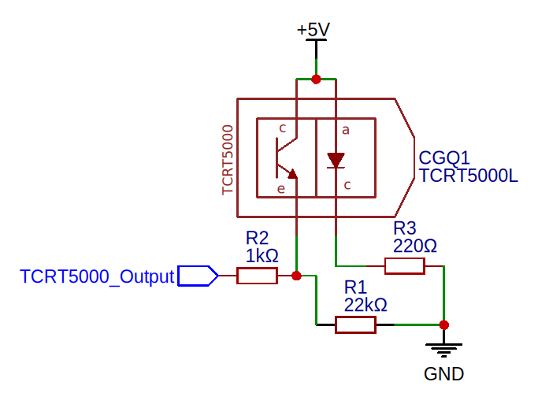

## Testes e Configuração final do IR

[<- Voltar](../README.md)

| Nº do Teste | Res. p/ Arduino x Res. p/ GND | Luz | Range de Valor  | Altura | Multiplicador |
|-------------|-------------------------------|-----|-----------------|--------|---------------|
| 1           | 0Ω x 4,7KΩ                    | Com | 130 - 175 = 45  | ?      | < x5          |
| 2           | 100Ω x 4,7KΩ                  | Sem | 20 - 100 = 80   | ?      | < x5          |
| 3           | 100Ω x 4,7KΩ                  | Com | 170 - 90 = 80   | ?      | < x5          |
| 4           | 100Ω x 4,7KΩ                  | Sem | 10 - 110 = 100  | ?      | < x5          |
| 5           | 1KΩ x 4,7KΩ                   | Sem | 25 - 160 = 135  | 85mm   | < x5          |
| 6           | 1KΩ x 10 KΩ                   | Sem | 325 - 75 = 250  | 85mm   | < x5          |
| 7           | 1KΩ x 22KΩ                    | Sem | 650 - 130 = 520 | 85mm   | < x5          |

#### Melhor Opção

| Nº do Teste | Res. p/ Arduino x Res. p/ GND | Luz | Range de Valor  | Altura | Multiplicador |
|-------------|-------------------------------|-----|-----------------|--------|---------------|
| 7           | 1KΩ x 22KΩ                    | Sem | 650 - 130 = 520 | 85mm   | < x5          |

## Código de Tratamento

```cpp
int readIr(int irPin, int potPin) {
    float multiplicationFactor = map(analogRead(potPin), 0, 1023, 1, 10);
    int value = analogRead(irPin);
    float treatedValue = ((float)value) * multiplicationFactor;
    return treatedValue;
}
```

## Circuito

